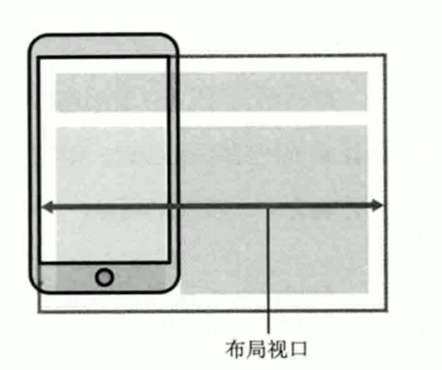
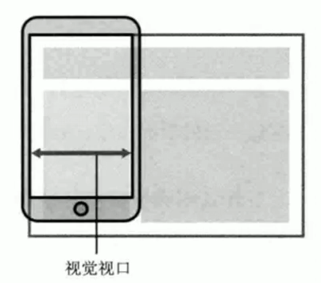

## 一 移动web开发概念

### 1.1 视口

移动web开发即针对移动端的浏览器进行web开发，目前移动端浏览器内核主要为 webkit 内核。  

PC端的页面直接放置在手机端显示，由于页面过大无法显示全，就会出现滚动条，为了解决该问题，引入了 视口。  

> 视口：viewport，即浏览器 显示页面内容的屏幕区域，分为 布局视口、视觉视口、理想视口

布局视口：在手机中，一般会默认会有一个 980px 分辨率的视口，所以PC端网页一般都可以显示在手机中，但是此时PC端的页面在手机端看起来就会变小。  

  


视觉视口：用户在手机端能看到的页面区域。 

    

理想视口：我们希望能够在视觉视口内全部显示完内容，又不会像布局视口那样大（不需要手指捏着屏幕看）。  

为了实现理想视口，需要手动添加 meta视口标签 通知浏览器操作，该标签的目的是让布局视口的宽度和理想视口的宽度一致，即设备有多宽，布局的视口就有多宽。  

视口示例：
```html
    <meta name="viewport" content="width=device-width, initial-scale=1.0">
```

content常见属性：
```
width               默认为device-width，即为理想视口，如果不加，默认按照 980px 显示，页面元素就会变得很小
user-scalable       是否允许用户缩放
initial-scale       最初的缩放比例，比如值为2，则页面一打开，缩放为默认大小的2倍显示         
```

标准的viewport设置推荐如下：
```
视口宽度和设备保持一致
视口的默认缩放比例为1.0
不允许用户自行缩放
最大允许缩放比例为1.0
最小允许缩放比例为1.0
```

### 1.2 倍图

